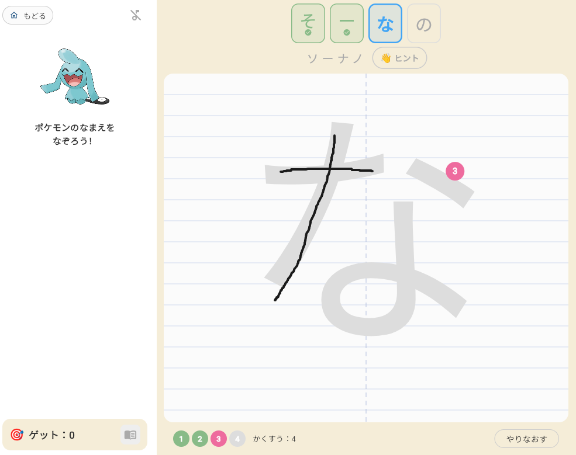
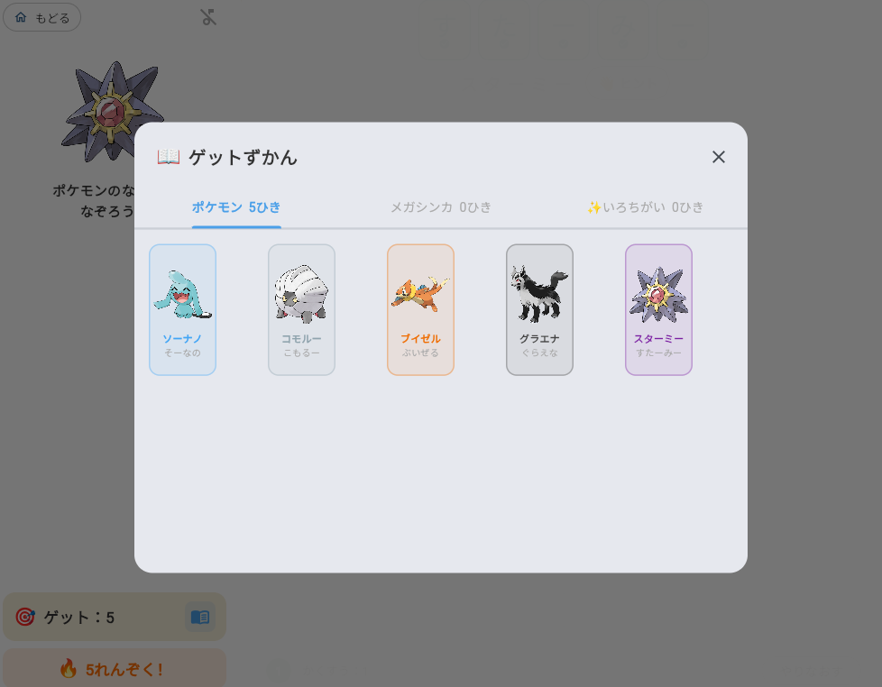

# ポケモンひらがな練習アプリ

子供がポケモンのなまえをなぞりながら、ひらがな・カタカナを楽しく練習できる Flutter Web アプリです。

**[▶ アプリを開く](https://kentaroy47.github.io/hiragana/)**

---

## スクリーンショット

| ポケモンなぞり | ゲット演出 |
|--------------|-----------|
|  |  |

---

## 機能

### ポケモンなぞりゲーム
- 第1〜9世代の人気ポケモン **200匹** からランダムに出題
- カタカナの名前を1文字ずつなぞる（例：フシギダネ → 5文字）
- カタカナが読めない子のために **ひらがなのふりがな** を表示
- なぞり完了で **ポケモンゲット！** 演出

### ゲーミフィケーション
- ⭐ **1〜3スター評価**（なぞりの正確さに応じて）
- 🔥 **れんぞくゲット**（連続でゲットするとカウント表示）
- 📖 **ゲットずかん**（ゲットしたポケモンを一覧表示）

### 学習サポート
- 👋 **なぞりヒント**（薄く文字を表示して手本を見せる）
- ✨ **キラキラエフェクト**（ゲット時にコンフェッティ）
- 🎵 **BGM**（チップチューンのメロディ、ON/OFF 切替可能）

### ひらがな・カタカナ1文字練習
- 50音マップから文字を選んで1文字ずつ練習
- ストローク数に応じた採点

---

## 技術スタック

| 項目 | 内容 |
|------|------|
| フレームワーク | Flutter (Web) |
| 言語 | Dart |
| 音声 | Web Audio API（パッケージなし） |
| ポケモン画像 | [PokeAPI](https://pokeapi.co/) 公式アートワーク |
| デプロイ | GitHub Actions → GitHub Pages |

---

## ローカル実行

```bash
flutter pub get
flutter run -d chrome
```

## ビルド・デプロイ

`main` ブランチへの push で GitHub Actions が自動的に GitHub Pages へデプロイします。

```bash
flutter build web --base-href /hiragana/ --release
```
